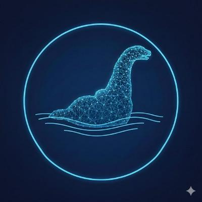

# Nessie — Graph Explorer

> Graph visualization platform with multi-panel VSCode-like interface.



## Tech Stack

- **Frontend**: Angular 17 (standalone components)
- **Layout**: GoldenLayout v2 (VSCode-like panels)
- **Visualization**: Canvas API (extendable to D3.js)
- **Styling**: SCSS with custom dark navy/cyan theme

## Architecture

```
src/app/
├── components/
│   ├── menubar/          # Top menu bar (File, View, Graph, Help)
│   ├── statusbar/        # Bottom status bar
│   ├── main-view/        # Main graph canvas (pan, zoom, drag)
│   ├── tree-view/        # Tree explorer panel
│   ├── bird-view/        # Minimap / bird's-eye overview
│   └── console-panel/    # Log console (closeable)
├── services/
│   ├── layout.service.ts # Panel state, console messages, selection sync
│   └── graph.service.ts  # Graph model & data management
```

## Layout

```
┌─────────────────────────────────────────────────────┐
│  NESSIE  File  View  Graph  Help            v0.1.0   │ ← Menubar
├──────────┬───────────┬────────────────────────────────┤
│          │           │                                │
│  Tree    │  Bird     │         Main View              │
│  View    │  View     │    (pan, zoom, drag)           │
│          │           │                                │
│  22%     │  18%      │         60%                    │
├──────────┴───────────┴────────────────────────────────┤
│                                                        │
│  Console (closeable)                                   │
│                                                        │
├────────────────────────────────────────────────────────┤
│  ● Demo Graph  |  6 nodes  |  6 edges  |  Directed     │ ← Statusbar
└────────────────────────────────────────────────────────┘
```

## Quick Start

### Prerequisites
- Node.js >= 18
- npm >= 9

### Installation

```bash
# Clone the repo
git clone <your-repo-url>
cd nessie

# Install dependencies
npm install

# Start development server
npm start
# or
ng serve
```

Open [http://localhost:4200](http://localhost:4200) in your browser.

### Load a Demo Graph

1. Click **File › Load Demo Graph** in the menu bar  
2. Or click the **⬡ Load Demo** button in the Main View toolbar

## Panel Controls

| Panel      | Toggle shortcut |
|------------|----------------|
| Tree View  | View › Tree View |
| Bird View  | View › Bird View |
| Console    | View › Console   |

Panels can also be resized and rearranged by dragging GoldenLayout tab headers.

## Cross-panel Node Selection

Clicking a node in **any** panel (Main View, Tree View, or Bird View) will:
- Highlight the node in **all three views**
- Update the status bar with the selected node ID
- Log the selection to the Console

## Extending the Platform

### Adding a Data Source Plugin

1. Create a service implementing graph ingestion:
   ```typescript
   // data-source-plugins/my-source.service.ts
   @Injectable({ providedIn: 'root' })
   export class MySourceService {
     parse(data: string): Graph { /* ... */ }
   }
   ```

2. Inject into `GraphService.setGraph()`

### Adding a Visualizer Plugin

1. Create a component that subscribes to `GraphService.graph$`
2. Register it as a GoldenLayout component in `app.component.ts`

## Build

```bash
ng build --configuration production
```

Output: `dist/nessie/`

## Project Structure (Full)

```
nessie/
├── src/
│   ├── app/
│   │   ├── components/     # UI components
│   │   ├── services/       # Business logic
│   │   ├── app.component.* # Root shell + GoldenLayout init
│   │   └── app.config.ts   # App providers
│   ├── styles.scss          # Global theme variables
│   └── index.html
├── angular.json
├── package.json
└── tsconfig.json
```
